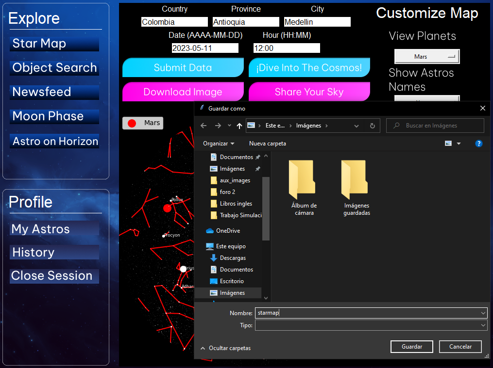

# _Py Man 's Sky_

## **Descripción**: 
Py Man's Sky es un proyecto que tiene como objetivo crear un mapa del cielo, en base a la ubicación y fechas ingresadas por el usuario, además de ser una app que busca la divulgación científica sobre la astronomía.

## **¿Por qué el proyecto es útil?**: 
La utilidad de este proyecto se enfoca en ser un contenido tanto didáctico como científico; didactico en que puedes generar un mapa del cielo personalizado y, cientifico ya que fomenta conocer más sobre la astronomía gracias al contenido sobre astros que presenta la aplicación, dentro del mapa, en su descripción y en la sección cultural dentro de esta. Esta sección cultural se enfoca en conocimiento sobre eventos científicos y culturales sobre la astronomía.

## **Objetivos principales del proyecto**:
- Crear un mapa del cielo con datos personalizados ingresados por el usuario.
- Acceder a información sobre los astros observados dentro del mapa.
- Acceder a una sección cultural con publicaciones sobre astronomía.

## **Descripción completa de la aplicación**:
- La aplicación de escritorio presentará una interfaz amigable para la exploración sencilla de la astronomía por medio de la inmersión a mapas estelares. 
    
    - **Interfaz principal para usuarios registrados:**
    
    - **Interfaz principal para invitados:**
    

- Los usuarios del aplicativo tendrán la opción de registrarse con un nombre de usuario y contraseña que les permitirá acceder a funcionalidades adicionales y guardar ciertos datos.

    - **Ventana de inicio:**
    
    - **Ventana creación de usuarios:**
    
    - **Ventana recuperacion de contraseñas:**
    

- Funcionalidades para usuarios registrados:
    - Generación de un mapa estelar personalizado; dicha personalización se basa en la selección de constelación visibles por cultura, fecha específica de la visualización, lugar geográfico de observación, variación de cantidad de estrellas visibles, y la posibilidad de habilitar y deshabilitar los nombres de las estrellas más importantes.
    - Visualizar un planeta del sistema solar (si es que está visible para la ubicación y fecha proporcionadas) sobre el mapa estelar.

        

    - Disponibilidad de información relevante acerca de las estrellas más importantes mostradas en el mapa generado, proveniente de páginas web que contienen datos sobre dichos astros.
    - Acceso a información sobre la cultura que dió origen a las constelaciones que se muestran en el mapa.

        

    - Acceso a una sección cultural, donde el usuario podrá visualizar las tendencias en subreddits relacionadas con astronomía y ciencia.

        

    - Posibilidad de publicar su mapa del cielo en Reddit, en el subreddit exclusivo de la aplicación.

        

    - Posibilidad de descargar el mapa generado como un archivo local.

        

    - Guardado de los últimos mapas generados.
    - Guardado del historial de publicaciones hechas en el subreddit compartiendo mapas de estrellas personalizados.

        

    - Guardado del historial de los últimos astros consultados y agregadas a favoritos.

        
        

    - Posibilidad de consulta sobre cuál es la fase de la luna correspondiente a una fecha ingresada y mostrarla con una imagen representativa.

        

    - Consultar cuándo será visible en el horizonte un objeto celeste seleccionado, en base a fecha(y ubicación).

        

- Funcionalidades para usuarios no registrados:
    - Generar un mapa estelar con las opciones predeterminadas por la aplicación en base a la ubicación ingresada por el usuario.
    - Permitir la visualización de los planetas que estén en el mapa generado.

        

    - Mostrar información sobre la cultura que dió origen a las constelaciones que se muestran en el mapa.

        
   
## **Tecnologías utilizadas**:
- Lenguaje de programación Python y librerias externas como: Skyfield, Matplotlib, Geopy, Datetime, Numpy, Pandas, PRAW, requests, entre otros.
- Figma para el diseño de las interfaces y Tkinter para codificarlas.

## **Guia de Instalación**

### Repositorio

Para poder ejecutar la aplicación desde el acceso a los archivos con extensión ".py", se deben seguir los siguientes pasos:

Descargar los archivos requeridos, ubicados en la carpeta "codigo" de este repositorio, e instalar las librerias requeridas para la correcta ejecucion de la aplicación.

Para instalar las librerías requeridas:
```sh
pip install -r requirements.txt
```

Una vez se tengan todos los archivos solicitados, comenzar la ejecución del programa desde el archivo AccessMenu.py

### Archivo ejecutable

Si por el contrario desea descargar el ejecutable de la aplicación, puede seguir los siguientes pasos desde un computador Windows (*La resolución del dispositivo debe ser mayor a 1024x768 para una mejor visualización y navegación de la aplicación):

- Acceder al siguiente link de drive y descargar el archivo: https://drive.google.com/drive/u/1/folders/1M0emamschkuB3WuaSUO6hlyisjoULbnx

- Descargar el archivo

    

    En caso de que drive genere un aviso de seguridad, continuar oprimiendo el botón "Descargar De Todos Modos"

    

- Abrir el archivo descargado:

    
    

    En caso de que windows genere posibles alertas de seguridad, continuar con tranquilidad

    

- Extraer el archivo

    
    

- Ingresar a la carpeta descargada y correr el archivo ejecutable

    

## Autores:
- [@YamidCampo](https://github.com/YamidCampo): Yamid Andrés Campo Gallego.
- [@JEROLPOA2](https://github.com/JEROLPOA2): Jerónimo Ledesma Patiño.
- [@DavedCV](https://github.com/DavedCV): David Castrillón Vallejo.
- [@karenrivgi](https://github.com/karenrivgi): Karen Rivera Giraldo.

<br/>

[](https://www.gnu.org/licenses/gpl-3.0)

