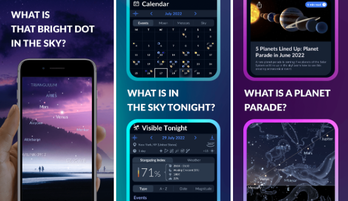

## Herramientas/aplicativos
_Herramientas/aplicativos que realizan funciones similares a la de nuestra aplicación y sus principales características_

- [**SkySafari - Astronomía**](https://play.google.com/store/apps/details?id=com.simulationcurriculum.skysafari5&hl=es_419&gl=US):

    SkySafari es una aplicación de celular, que tiene como función ser un poderoso planetario. Este planetario se encuentra en la interfaz principal de la aplicación y es interactivo, este mapa se genera en base a la ubicación actual del celular, pidiendo permiso para acceder a nuestra ubicación y también usando la fecha y hora del momento, al mover el celular de un lado a otro el mapa que muestra la aplicación se va moviendo conforme a nuestro movimiento y va desvelando más partes del mapa.
    
    Esta aplicación tiene muchas más funciones:  
    - Permite buscar astros, planetas, constelaciones, satélites, cometas, galaxias y demás, que ya están preestablecidos por la aplicación en el mapa interactivo.
    - Nos da una descripción de cada uno de estos objetos preestablecidos.
    - Nos permite cambiar la ubicación, la fecha, personalizar el mapa, personalizar cómo se visualizan las constelaciones y demás cambios.
    - También tiene un calendario que nos muestra fechas importantes con sucesos astronómicos.
      
    
      
    
- [**Starmap - didiendo**](https://starmap.didiendo.com/):

    Starmap - didiendo, es una página web que permite generar un mapa del cielo y descargarlo. Esta página permite al usuario ingresar su dirección específica; ingresando desde un Maps interactivo o como latitud y longitud, además permite ingresar una fecha y hora específica. También tiene múltiples opciones de personalización para el mapa generado, como mostrar las constelaciones, mostrar los planetas, visualizar más grande los planetas, aumentar el tamaño de las estrellas, poder visualizar la vía láctea en el mapa, agregar etiquetas a estrellas, mapas o constelaciones, cambiar el fondo del mapa y demás.
      
    
     
    
- [**Sky Tonight - Star Gazer Guide**](https://play.google.com/store/apps/details?id=com.vitotechnology.sky.tonight.map.star.walk&hl=en&gl=US):

    Sky Tonight es una aplicación de astronomía que permite explorar el cielo, ayudando en la respuesta de preguntas cómo: ¿Qué es ese punto brillante en el cielo? ¿Qué eventos astronómicos puedo ver hoy? ¿Cómo puedo encontrar objetos en los que estoy interesado?
    
    La aplicación permite ajustar la apariencia de las constelaciones, establecer un recordatorio para cualquier configuración de cuerpo espacial, explorar el cielo en la trayectoria relativa al observador, definir un límite para filtrar objetos en el espacio, entre otras funcionalidades.
    
    Entre las características más importantes presentes en la aplicación, se pueden mencionar las siguientes:

    - Trayectoria interactivas relativas al observador: en lugar de la trayectoria clásica que muestra la trayectoria del objeto en la esfera celestial relativa al centro de la tierra, la aplicación presenta una trayectoria del objeto en el cielo, relativa a la ubicación del observador.
    - Calendario astronómico con índice de observación de estrellas y pronóstico del tiempo: chequea el calendario de eventos celestiales que incluye fases lunares, lluvia de meteoritos, eclipses, y otros eventos interesantes; tanto históricamente como próximos a suceder.
    - Uso de mapa interactivo para apuntar el dispositivo móvil al cielo y ver las posiciones reales de objetos espaciales.
      
    

## Software open source
_Software open source que nos puede ser de utilidad para el desarrollo de la aplicación_

**Diseño De Interfaz De Usuario:** 

Para simplificar y agilizar el proceso de construir una interfaz contamos con las siguientes alternativas de maquetación gráfica:

- [**MatDeck GUI Designer**](https://labdeck.com/gui-designer/): Es uno de los productos de la empresa MatDeck, puede adquirirse tanto en versión paga como en versión gratuita y permite crear interfaces gráficas con el método de “arrastrar y soltar”, dispone de múltiples tipos de botones, widgets y menús, los cuales pueden programarse por medio de un sistema de eventos.

- [**Qt Designer**](https://doc.qt.io/): Es un complemento gratuito para el diseño de interfaces, sus archivos pueden ser exportados a diversos lenguajes de programación, incluido Python, igual que su contraparte dispone de botones widgets y menús enteramente personalizables y ofrece además la posibilidad de cargar recursos propios del computador para complementar.

**Material astronómico**:
- [**Stellarium**](https://github.com/Stellarium/stellarium): Según su definición, es “un planetario open source para tu computador”, permite ver un cielo realista tal y como si lo estuviéramos viendo con nuestros ojos, binoculares o un telescopio. Su repositorio en GitHub contiene información que nos es útil para complementar los datos de SkyField, pues contiene archivos que dan cuenta, por ejemplo, de cómo se divide el cielo para formar constelaciones. 

## Librerías disponibles
_Librerías disponibles en Python que pueden ser de utilidad para el desarrollo de la aplicación y sus principales características_

#### Librerías para generar el mapa del cielo:
- [**SkyField**](https://rhodesmill.org/skyfield/): Permite computar fácilmente la posición de estrellas, planetas y satélites en órbita alrededor de la tierra con una alta precisión. Además, contiene una base de datos amplia con valores astronómicos a la que podemos acceder desde skyfield.data, de allí obtendremos, casi en su totalidad, la información que necesitamos para construir el mapa del cielo.

- [**Matplotlib Pyplot**](https://matplotlib.org/): Permite crear visualizaciones de datos en Python, nos será útil para convertir la información que obtengamos en un gráfico estilizado que el usuario pueda comprender y sea atractivo para él.

- [**Geopy**](https://github.com/geopy/geopy): Permite obtener las coordenadas de diferentes puntos de referencia alrededor del mundo mediante el uso de geocodificadores (proceso de transformar una descripción de una ubicación (por ejemplo, un par de coordenadas, una dirección o un nombre de un lugar) en una ubicación de la superficie de la Tierra.) de terceros. Nos será útil para transformar la ubicación pasada por el usuario y posteriormente usarla como base para generar el mapa del cielo.
    
- [**Datetime**](https://docs.python.org/es/3/library/datetime.html): Librería propia de Python especializada en el manejo y tratamiento de fechas y tiempos, la cuál será fundamental para el propósito de este proyecto, pues a partir de estos datos podremos generar un mapa del cielo “personalizado” para cada usuario.

- [**Numpy**](https://numpy.org/doc/stable/): SkyField se apoya en Numpy al ser este el paquete fundamental para la computación científica en Python, pues puede manejar vectores, matrices y una gran colección de funciones matemáticas de alto nivel. Son precisamente esas operaciones vectoriales las que hacen que una librería como SkyField sea eficiente.

- [**Pandas**](https://pandas.pydata.org/): Es una librería dedicada a la manipulación de datos, a través de múltiples tipos de archivos pueden construirse datasets y utilizar las herramientas dispuestas para efectuar operaciones para su procesamiento y análisis. La librería se caracteriza por ser intuitiva, versátil y estar altamente optimizada para trabajos de gran exigencia computacional.

#### Librerías para conectar la aplicación con redes sociales: 
- [**Tweetpy**](https://docs.tweepy.org/en/stable/): Esta librería permite la integración con la API de twitter, y aprovechando sus capacidades podríamos extraer tweets sobre divulgación astronómica para mostrar en nuestra aplicación además se podría publicar tweets sobre los mapas del cielo, también desde nuestra aplicación.

- [**Snscrape**](https://www.freecodecamp.org/news/python-web-scraping-tutorial/): Como tweepy permite hacer scraping de información de twitter, pero en su caso no requiere el uso de ninguna API. Por esta razón, su funcionalidad es más básica que la de tweepy, pero permite obtener información del perfil de usuario, contenido de un tweet, etc, que podrían bastar para nuestro propósito.

- [**Requests**](https://requests.readthedocs.io/en/latest/): Es una librería simple y elegante para procesar peticiones HTTP de manera sencilla, facilitando en nuestro caso el proceso de conexión y peticiones con API 's.  

- [**PRAW**](https://praw.readthedocs.io/en/stable/): Es un paquete que permite obtener un acceso de forma sencilla a la API de reddit. El paquete es sencillo de usar y permite una configuración directa y ágil con las diferentes reglas que se imponen en la misma API.

