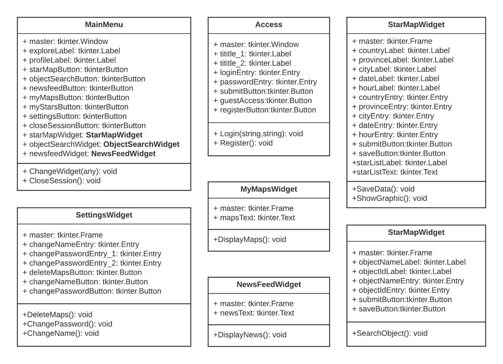

En base a las funcionalidades previstas para la aplicación, definimos las siguientes actividades a desarrollar para construirlas:

- **Informe 03: 13 horas del viernes 24 de marzo, “Hola Mundo” de la aplicación:**
-- Interfaz simple para la interacción del usuario con el aplicativo.
-- Generación de un  mapa básico de estrellas a partir de los datos de ubicación y hora ingresados por el usuario (Conteniendo nombre de las estrellas más brillantes y muestra de las constelaciones modernas sobre el mapa)
-- Prueba de la conexión con la API de reddit y funcionalidad de publicar el mapa estelar en un subreddit propio de la aplicación.

- **Informe 04: 13 horas del viernes 31 de marzo.**
-- Implementación de la lógica orientada a objetos para la creación de usuarios.
-- Discretización de la interfaz para usuarios registrados y no registrados.
-- Refinamiento de la interfaz gráfica usando programación orientada a objetos.
      
    
     
-- Implementación de la descarga del mapa generado como imagen para usuarios registrados.
-- Aplicar la persistencia de datos para los usuarios creados, y un historial para los datos que ha ingresado al generar un mapa estelar.

- **Informe 05: 13 horas del viernes 14 de abril.** 
-- Implementación de opción que permita visualizar planetas del sistema solar en el mapa generado (si son visibles en la ubicación y hora proporcionadas).
-- Habilitación de las opciones para la modificación del mapa con los parámetros definidos, a los usuarios registrados.
-- Integración de funcionalidades API Reddit.
   + Publicación de los mapas generados por el usuario en el subreddit.
   + Guardar el historial de las publicaciones hechas en el subreddit.

- **Informe 06: 13 horas del viernes 21 de abril.**
  -- Implementación del sistema de búsqueda de objetos celestes y de la identificación de objetos en el mapa este ar generado:
  +  Extraer la información relevante sobre las estrellas más importantes de la página www.universeguide.com , que dado un número del catálogo de Hipparcos y el nombre de una estrella permite visualizar datos variados sobre este objeto.
  +  Exponer la información recolectada a un lado del mapa generado, listando únicamente las estrellas visibles en dicho mapa.
  + Implementación de historial para últimas estrellas consultadas.
  + Mostrar información sobre el contexto cultural de la constelación escogida para visualizarse en el mapa.

- **Informe 07: 13 horas del viernes 28 de abril.**
  -- Implementación de sección cultural y de entretenimiento en la interfaz.
  + Se proporcionarán publicaciones, información y eventos astronómicos extraídos por medio de web scraping y de las APIS.
  + Modificar la interfaz de modo que estas publicaciones puedan ser observadas en otra sección del aplicativo.

- **Informe 08: 13 horas del viernes 5 de mayo.**
-- Creación de la sección para consultar cuál es la fase de la luna correspondiente a una fecha ingresada.
-- Manejo de excepciones para las entradas de los usuarios.
-- Optimización y refinamiento de funcionalidades e interfaces.

- **Informe 09: 13 horas del viernes 12 de mayo.**
  -- Conclusión optimización de la interfaz de la aplicación.
  -- Creación de la funcionalidad para consultar cuándo será visible en el horizonte un objeto celeste seleccionado, en base a fecha (y ubicación).

- **Informe 10: 13 horas del viernes 26 de mayo.**
-- Correcciones y ajustes finales en base a la sustentación realizada del informe 09.
